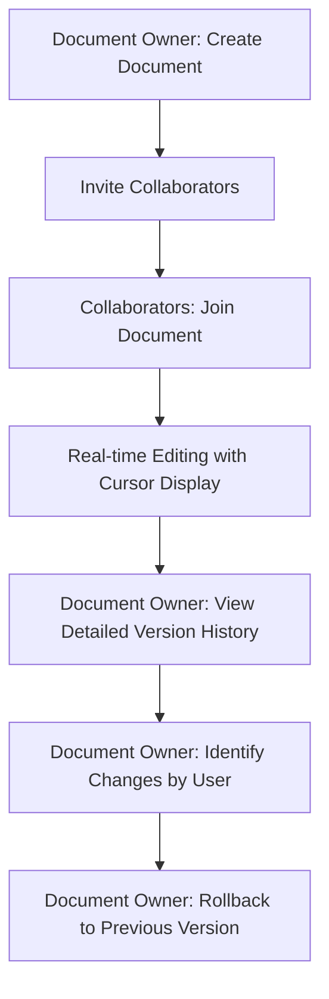

## 1. Product Overview
协作文档应用是一个实时多人协作编辑平台，专注于实时光标显示和详细的版本控制功能。
- 主要解决多人同时编辑文档时的协作问题，提供实时光标显示和精确的版本管理能力
- 目标用户为需要团队协作的企业、教育机构和个人用户

## 2. Core Features

### 2.1 User Roles
| Role | Registration Method | Core Permissions |
|------|---------------------|------------------|
| Document Owner | Email registration | Create documents, invite collaborators, view detailed version history, rollback to any version, track changes by user |
| Collaborator | Invitation link | Edit documents, view own edits, see real-time cursor positions |

### 2.2 Feature Module
1. **Real-time Cursor Display**: Show cursor positions of all users with usernames in real-time
2. **Collaborative Editing**: Multiple users can edit simultaneously with real-time updates
3. **Version Control**: Detailed change history, user-specific modifications tracking, version rollback
4. **User Management**: Invite collaborators, manage permissions

### 2.3 Page Details
| Page Name | Module Name | Feature description |
|-----------|-------------|---------------------|
| Document Editor | Real-time Cursor Display | Show cursor positions of all active users with their usernames, different colors for each user |
| Document Editor | Collaborative Editing | Multiple users can edit the document simultaneously with real-time updates |
| Document Editor | User Presence | Display list of currently active users in the document |
| Version Control | Detailed History | Show chronological list of document changes with timestamps, user info, and specific content modifications |
| Version Control | Change Tracking | Highlight which parts of the document were modified by each user |
| Version Control | Rollback | Allow document owners to revert to any previous version |
| User Management | Invite Users | Generate invitation links for collaborators |

## 3. Core Process
### Main User Flows
1. **Document Creation**: User creates a new document and becomes the owner
2. **Collaboration**: Owner invites collaborators via email or link
3. **Real-time Editing**: Multiple users edit the document simultaneously with cursor visibility and username display
4. **Version Management**: Owner reviews detailed edit history, identifies which parts were modified by whom, and rolls back to previous versions if needed

## 4. User Interface Design
### 4.1 Design Style
- Primary color: #3B82F6 (blue)
- Secondary color: #10B981 (green)
- Accent colors: #F59E0B (yellow), #EF4444 (red)
- Button style: Rounded corners with subtle shadows
- Font: Inter (sans-serif)
- Font sizes: 14px (body), 16px (headings), 12px (captions)
- Layout style: Clean, minimalist with focused editing area
- Icon style: Simple, line-based icons from Lucide

### 4.2 Page Design Overview
| Page Name | Module Name | UI Elements |
|-----------|-------------|-------------|
| Document Editor | Editing Area | White background, black text, responsive layout, proper spacing |
| Document Editor | Cursor Indicators | Colored cursor markers with username labels, different colors for each user, real-time updates |
| Document Editor | User List | Sidebar showing active users with avatars, status indicators, and cursor positions |
| Version Control | History Panel | Timeline view of changes with user avatars, timestamps, and change previews |
| Version Control | Change Highlighting | Visual indicators showing which parts of the document were modified by each user |
| Version Control | Rollback Interface | Interactive timeline with rollback buttons and version previews |
| User Management | Invite Form | Simple form with email input and permission dropdown |

### 4.3 Responsiveness
- Desktop-first design with mobile adaptation
- Editing area optimizes for screen size
- Side panels collapse on mobile devices
- Touch-friendly interface for mobile users

### 4.4 3D Scene Guidance
Not applicable for this project.