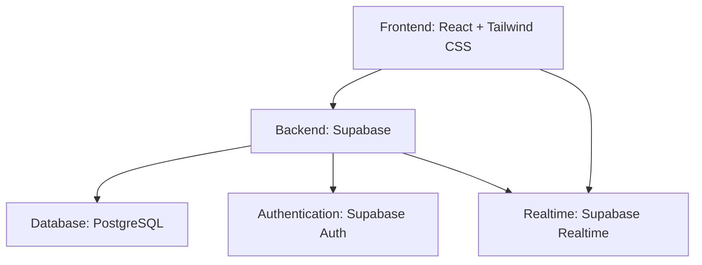
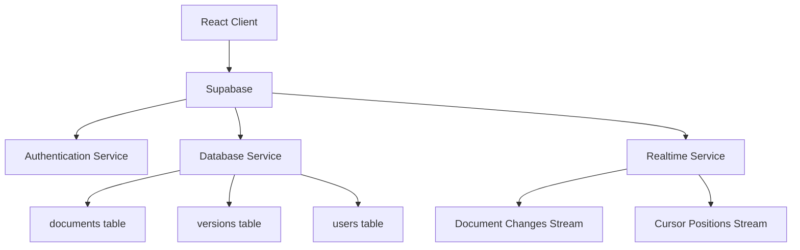
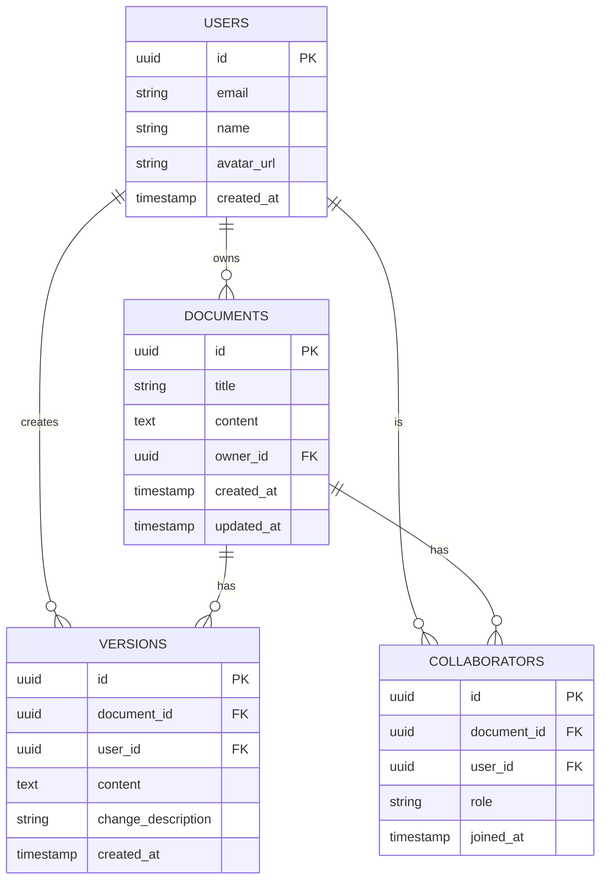

## 1. Architecture Design


## 2. Technology Description
- Frontend: React@18 + Tailwind CSS@3 + Vite
- Initialization Tool: Vite-init
- Backend: Supabase (Authentication, Database, Realtime)
- Database: Supabase (PostgreSQL)
- Real-time Collaboration: Supabase Realtime
- State Management: Zustand
- UI Icons: Lucide React

## 3. Route Definitions
| Route | Purpose |
|-------|---------|
| / | Document list page |
| /document/:id | Document editor page |
| /document/:id/history | Version history page |

## 4. API Definitions
### 4.1 Supabase Client SDK
- Authentication: `supabase.auth`
- Database: `supabase.from()`
- Realtime: `supabase.channel()`

## 5. Server Architecture Diagram


## 6. Data Model
### 6.1 Data Model Definition


### 6.2 Data Definition Language
```sql
-- Create users table (managed by Supabase Auth)
-- Note: Supabase automatically creates and manages the auth.users table

-- Create documents table
CREATE TABLE documents (
  id UUID PRIMARY KEY DEFAULT gen_random_uuid(),
  title TEXT NOT NULL,
  content TEXT NOT NULL,
  owner_id UUID NOT NULL REFERENCES auth.users(id),
  created_at TIMESTAMP WITH TIME ZONE DEFAULT NOW(),
  updated_at TIMESTAMP WITH TIME ZONE DEFAULT NOW()
);

-- Create versions table
CREATE TABLE versions (
  id UUID PRIMARY KEY DEFAULT gen_random_uuid(),
  document_id UUID NOT NULL REFERENCES documents(id),
  user_id UUID NOT NULL REFERENCES auth.users(id),
  content TEXT NOT NULL,
  change_description TEXT,
  created_at TIMESTAMP WITH TIME ZONE DEFAULT NOW()
);

-- Create collaborators table
CREATE TABLE collaborators (
  id UUID PRIMARY KEY DEFAULT gen_random_uuid(),
  document_id UUID NOT NULL REFERENCES documents(id),
  user_id UUID NOT NULL REFERENCES auth.users(id),
  role TEXT NOT NULL DEFAULT 'collaborator',
  joined_at TIMESTAMP WITH TIME ZONE DEFAULT NOW(),
  UNIQUE(document_id, user_id)
);

-- Create indexes
CREATE INDEX idx_documents_owner_id ON documents(owner_id);
CREATE INDEX idx_versions_document_id ON versions(document_id);
CREATE INDEX idx_versions_user_id ON versions(user_id);
CREATE INDEX idx_collaborators_document_id ON collaborators(document_id);
CREATE INDEX idx_collaborators_user_id ON collaborators(user_id);

-- Enable Row Level Security
ALTER TABLE documents ENABLE ROW LEVEL SECURITY;
ALTER TABLE versions ENABLE ROW LEVEL SECURITY;
ALTER TABLE collaborators ENABLE ROW LEVEL SECURITY;

-- Create policies for documents
CREATE POLICY "Document owners can manage their documents" ON documents
  FOR ALL USING (owner_id = auth.uid());

CREATE POLICY "Collaborators can view documents" ON documents
  FOR SELECT USING (
    EXISTS (
      SELECT 1 FROM collaborators 
      WHERE collaborators.document_id = documents.id 
      AND collaborators.user_id = auth.uid()
    )
  );

-- Create policies for versions
CREATE POLICY "Document owners can view all versions" ON versions
  FOR SELECT USING (
    EXISTS (
      SELECT 1 FROM documents 
      WHERE documents.id = versions.document_id 
      AND documents.owner_id = auth.uid()
    )
  );

-- Create policies for collaborators
CREATE POLICY "Document owners can manage collaborators" ON collaborators
  FOR ALL USING (
    EXISTS (
      SELECT 1 FROM documents 
      WHERE documents.id = collaborators.document_id 
      AND documents.owner_id = auth.uid()
    )
  );

-- Grant permissions
GRANT SELECT ON documents TO anon, authenticated;
GRANT ALL PRIVILEGES ON documents TO authenticated;

GRANT SELECT ON versions TO anon, authenticated;
GRANT ALL PRIVILEGES ON versions TO authenticated;

GRANT SELECT ON collaborators TO anon, authenticated;
GRANT ALL PRIVILEGES ON collaborators TO authenticated;
```