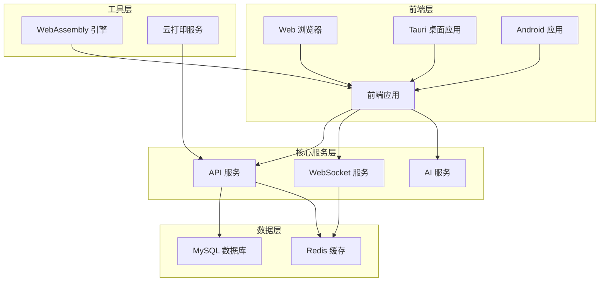

# EasyPocketMD 项目代码文档

## 1. 项目概述

EasyPocketMD 是一款几乎零学习成本的智能 Markdown 编辑器，无需记忆语法，通过 `/` 斜杠命令即可轻松插入格式化文本、LaTeX 公式和精美图表。配合全文智能搜索与强大 AI 助手，让复杂任务几步完成！

- **AI 驱动**：内置 AI 写作助手、智能图表与公式生成、一键生成 PPT 等功能
- **极速启动**：基于 Tauri 构建的轻量级桌面应用，安装包仅十几 MB
- **全平台**：支持 Windows、Linux、macOS、Android 与 Web
- **零学习成本**：通过斜杠命令快速插入各种元素，无需记忆 Markdown 语法

## 2. 目录结构

项目采用模块化架构，清晰分离前端、后端、跨平台和工具模块：

```
├── api/                    # 后端 API 服务
│   ├── config/             # 数据库/缓存配置
│   ├── middleware/         # 中间件 (限流、认证等)
│   ├── models/             # 核心业务模型
│   ├── realtime/           # WebSocket 实时协作
│   ├── routes/             # API 路由
│   ├── services/           # 外部服务集成
│   └── utils/              # 工具函数
├── js/                     # 前端源码
│   ├── files/              # 文件管理
│   ├── page/               # 页面逻辑
│   └── ui/                 # UI 组件
├── wasm_text_engine/       # WebAssembly 高性能模块
├── src-tauri/              # Tauri 跨平台应用
├── tests/                  # 测试代码
│   ├── integration/        # 集成测试
│   └── unit/               # 单元测试
├── print/                  # 云打印服务
└── scripts/                # 构建与部署脚本
```

## 3. 系统架构

### 3.1 技术栈

- **前端**：JavaScript + Vite + WebAssembly (C/C++)
- **后端**：Node.js + Express + MySQL + Redis
- **实时协作**：WebSocket
- **跨平台**：Tauri (桌面/Android)
- **云打印**：Python

### 3.2 架构图



## 4. 核心模块

### 4.1 后端 API 服务

API 服务是项目的核心后端组件，负责处理文件操作、用户认证、实时协作等功能。

**主要功能**：
- 文件管理：创建、读取、更新、删除文件
- 用户认证：登录、注册、权限管理
- 实时协作：基于 WebSocket 的多人实时编辑
- AI 集成：AI 写作助手、图表生成、PPT 导出
- 文件转换：支持多种格式的导入导出

**关键文件**：
- [api/server.js](file:///workspace/api/server.js) - 后端服务入口
- [api/models/FileManager.js](file:///workspace/api/models/FileManager.js) - 文件管理核心逻辑
- [api/models/ShareManager.js](file:///workspace/api/models/ShareManager.js) - 分享与协作管理
- [api/models/HistoryManager.js](file:///workspace/api/models/HistoryManager.js) - 版本历史管理

### 4.2 前端应用

前端应用提供用户界面和交互功能，包括编辑器、文件管理、AI 助手等。

**主要功能**：
- Markdown 编辑器：支持所见即所得、即时渲染、分屏预览三种模式
- 斜杠命令：快速插入格式化文本、公式、图表等
- 文件管理：本地文件操作、云同步
- AI 助手：智能写作、改写、排版
- 实时协作：多人同步编辑、在线状态显示

**关键文件**：
- [js/main.js](file:///workspace/js/main.js) - 前端主逻辑
- [js/ui/ai-assistant.js](file:///workspace/js/ui/ai-assistant.js) - AI 助手功能
- [js/files/index.ts](file:///workspace/js/files/index.ts) - 文件管理逻辑

### 4.3 WebAssembly 引擎

WebAssembly 模块提供高性能的文本处理和图像处理功能，提升应用响应速度。

**主要功能**：
- 文本处理：高性能 Markdown 解析和渲染
- 图像处理：图像压缩和优化
- 斜杠命令索引：快速响应斜杠命令

**关键文件**：
- [wasm_text_engine/src/text_engine.cpp](file:///workspace/wasm_text_engine/src/text_engine.cpp) - 文本引擎核心
- [wasm_text_engine/src/image_compressor.cpp](file:///workspace/wasm_text_engine/src/image_compressor.cpp) - 图像压缩器

### 4.4 跨平台应用

基于 Tauri 构建的跨平台应用，提供桌面和移动设备的原生体验。

**主要功能**：
- 桌面应用：Windows、Linux、macOS
- 移动应用：Android
- 系统集成：文件系统访问、系统托盘

**关键文件**：
- [src-tauri/src/main.rs](file:///workspace/src-tauri/src/main.rs) - Tauri 应用入口
- [src-tauri/tauri.conf.json](file:///workspace/src-tauri/tauri.conf.json) - Tauri 配置

### 4.5 云打印服务

基于 Python 的云打印服务，支持远程打印功能。

**主要功能**：
- 远程打印：通过网络发送打印任务
- 打印队列管理：处理打印任务队列
- 打印状态监控：实时显示打印状态

**关键文件**：
- [print/print_server.py](file:///workspace/print/print_server.py) - 打印服务器
- [print/print_client.py](file:///workspace/print/print_client.py) - 打印客户端

## 5. 关键类与函数

### 5.1 后端核心类

#### FileManager

文件管理核心类，负责文件的增删改查和版本控制。

**主要方法**：
- `getUserFiles(username)` - 获取用户文件列表
- `getFileContent(username, filename)` - 获取文件内容
- `saveFile(username, filename, content, optimisticLock)` - 保存文件
- `saveFileWithHistory(username, filename, content, createHistory, optimisticLock)` - 保存文件并创建历史记录
- `deleteFile(username, filename)` - 删除文件
- `syncFiles(username, files)` - 同步文件

**文件位置**：[api/models/FileManager.js](file:///workspace/api/models/FileManager.js)

#### ShareManager

分享与协作管理类，负责文档分享和实时协作功能。

**主要方法**：
- `createShare(username, filename, options)` - 创建分享链接
- `getShareContent(shareId)` - 获取分享内容
- `updateShareContent(shareId, content)` - 更新分享内容
- `deleteShare(shareId)` - 删除分享

**文件位置**：[api/models/ShareManager.js](file:///workspace/api/models/ShareManager.js)

#### HistoryManager

版本历史管理类，负责文件版本控制和历史记录。

**主要方法**：
- `createHistory(username, filename, content)` - 创建历史记录
- `getHistory(username, filename)` - 获取历史记录
- `restoreFromHistory(username, filename, historyId)` - 从历史记录恢复

**文件位置**：[api/models/HistoryManager.js](file:///workspace/api/models/HistoryManager.js)

#### User

用户管理类，负责用户认证和用户信息管理。

**主要方法**：
- `register(username, password, email)` - 用户注册
- `login(username, password)` - 用户登录
- `getUserInfo(username)` - 获取用户信息

**文件位置**：[api/models/User.js](file:///workspace/api/models/User.js)

### 5.2 前端核心函数

#### initEditor

初始化 Markdown 编辑器，配置编辑器选项和事件监听。

**参数**：
- `container` - 编辑器容器元素
- `options` - 编辑器配置选项

**返回值**：编辑器实例

**文件位置**：[js/main.js](file:///workspace/js/main.js)

#### initSlashCommand

初始化斜杠命令功能，注册各种命令和处理逻辑。

**参数**：
- `editor` - 编辑器实例

**文件位置**：[js/ui/slash-command.js](file:///workspace/js/ui/slash-command.js)

#### initAIAssistant

初始化 AI 助手功能，配置 AI 相关功能和事件处理。

**参数**：
- `editor` - 编辑器实例

**文件位置**：[js/ui/ai-assistant.js](file:///workspace/js/ui/ai-assistant.js)

#### initFileManager

初始化文件管理器，处理文件的打开、保存、同步等操作。

**参数**：
- `editor` - 编辑器实例

**文件位置**：[js/files/index.ts](file:///workspace/js/files/index.ts)

### 5.3 WebSocket 服务

#### initShareCollabServer

初始化实时协作服务器，处理 WebSocket 连接和消息传递。

**参数**：
- `server` - HTTP 服务器实例
- `shareManager` - 分享管理器实例

**文件位置**：[api/realtime/shareCollabServer.js](file:///workspace/api/realtime/shareCollabServer.js)

## 6. 依赖关系

### 6.1 核心依赖

| 依赖名称 | 版本 | 用途 | 来源 |
|---------|------|------|------|
| @sunhouyun/vditor | ^3.11.4 | Markdown 编辑器 | [package.json](file:///workspace/package.json) |
| express | ^4.18.2 | 后端框架 | [package.json](file:///workspace/package.json) |
| mysql2 | ^3.6.5 | MySQL 数据库驱动 | [package.json](file:///workspace/package.json) |
| ioredis | ^5.10.1 | Redis 客户端 | [package.json](file:///workspace/package.json) |
| ws | ^8.18.0 | WebSocket 服务 | [package.json](file:///workspace/package.json) |
| echarts | ^6.0.0 | 图表库 | [package.json](file:///workspace/package.json) |
| @tauri-apps/cli | ^2.10.1 | Tauri 构建工具 | [package.json](file:///workspace/package.json) |
| jest | ^30.2.0 | 测试框架 | [package.json](file:///workspace/package.json) |
| vite | ^7.3.1 | 前端构建工具 | [package.json](file:///workspace/package.json) |

### 6.2 外部服务依赖

| 服务 | 版本 | 用途 | 配置文件 |
|------|------|------|----------|
| MySQL | ≥ 5.7 | 数据存储 | [api/config/db.js](file:///workspace/api/config/db.js) |
| Redis | ≥ 6.0 | 缓存与协作 | [api/config/redis.js](file:///workspace/api/config/redis.js) |
| Python | ≥ 3.6 | 云打印服务 | [print/requirements.txt](file:///workspace/print/requirements.txt) |

## 7. 运行方式

### 7.1 环境要求

- **Node.js** ≥ 18.0
- **Python** ≥ 3.6 (云打印服务)
- **MySQL** ≥ 5.7 (数据存储)
- **Redis** ≥ 6.0 (缓存与协作)
- **npm** ≥ 9.0

### 7.2 安装与启动

1. **克隆仓库**
   ```bash
   git clone https://github.com/sunhouy/EasyPocketMD.git
   cd easypocketmd
   ```

2. **安装依赖**
   ```bash
   npm install
   ```

3. **配置环境**
   ```bash
   cp .env.example .env
   # 编辑 .env 文件，配置数据库、Redis、端口等
   ```

4. **初始化数据库**
   创建 MySQL 数据库和数据表（结构见 [db.sql](file:///workspace/db.sql)），并确保 Redis 已启动。

5. **构建前端**
   ```bash
   npm run build
   ```

6. **启动应用**
   ```bash
   npm start
   ```

7. **开发模式**
   ```bash
   # 前端开发
   npm run dev
   
   # Tauri 桌面开发
   npm run tauri:dev
   
   # Android 开发
   npm run tauri:android:dev
   ```

### 7.3 构建与部署

**构建命令**：
- `npm run build` - 完整构建（含 WebAssembly）
- `npm run build:web` - 仅构建 Web 版本
- `npm run build:tauri:win` - 构建 Windows 桌面应用
- `npm run build:tauri:linux` - 构建 Linux 桌面应用
- `npm run build:tauri:mac` - 构建 macOS 桌面应用
- `npm run tauri:android:build` - 构建 Android 应用

**部署建议**：
- 生产环境推荐使用 PM2 管理进程：
  ```bash
  npm install -g pm2
  pm2 start api/server.js --name "easypocketmd"
  ```

## 8. 开发指南

### 8.1 目录结构约定

- **api/** - 后端代码，遵循 MVC 架构
- **js/** - 前端代码，按功能模块组织
- **wasm_text_engine/** - WebAssembly 模块，使用 C/C++ 开发
- **src-tauri/** - Tauri 跨平台应用代码
- **tests/** - 测试代码，包括单元测试和集成测试
- **scripts/** - 构建和部署脚本

### 8.2 编码规范

- **JavaScript/TypeScript**：遵循 ES6+ 标准，使用 camelCase 命名变量和函数
- **Python**：遵循 PEP 8 规范
- **C/C++**：遵循 Google C++ 风格指南
- **Rust**：遵循 Rust 官方风格指南

### 8.3 常用开发命令

| 命令 | 描述 |
|------|------|
| `npm run dev` | 启动前端开发服务器 |
| `npm start` | 启动后端服务 |
| `npm test` | 运行测试套件 |
| `npm run wasm:text:build` | 构建 WebAssembly 文本引擎 |
| `npm run wasm:image:build` | 构建 WebAssembly 图像压缩器 |
| `npm run tauri:dev` | 启动 Tauri 桌面开发模式 |
| `npm run tauri:android:dev` | 启动 Android 开发模式 |

## 9. 测试指南

### 9.1 测试类型

- **单元测试**：测试单个模块和函数的功能
- **集成测试**：测试模块之间的交互和集成
- **端到端测试**：测试完整的用户流程

### 9.2 运行测试

```bash
# 运行所有测试
npm test

# 运行特定测试文件
npx jest tests/unit/FileManager.test.js
```

### 9.3 测试覆盖

项目使用 Jest 进行测试，测试覆盖率通过 Codecov 进行监控。

## 10. 部署指南

### 10.1 服务器配置

- **推荐配置**：
  - CPU: 2 核以上
  - 内存: 4GB 以上
  - 存储: 50GB 以上
  - 网络: 100Mbps 以上

- **环境要求**：
  - Node.js 18.0+
  - MySQL 5.7+
  - Redis 6.0+
  - Python 3.6+ (云打印服务)

### 10.2 部署步骤

1. **安装依赖**
   ```bash
   npm install
   ```

2. **构建应用**
   ```bash
   npm run build
   ```

3. **配置环境变量**
   ```bash
   cp .env.example .env
   # 编辑 .env 文件，配置生产环境参数
   ```

4. **启动服务**
   ```bash
   # 使用 PM2 管理进程
   npm install -g pm2
   pm2 start api/server.js --name "easypocketmd"
   
   # 设置 PM2 开机自启
   pm2 startup
   pm2 save
   ```

5. **配置 Nginx 反向代理**
   ```nginx
   server {
       listen 80;
       server_name example.com;
       
       location / {
           proxy_pass http://localhost:3000;
           proxy_http_version 1.1;
           proxy_set_header Upgrade $http_upgrade;
           proxy_set_header Connection 'upgrade';
           proxy_set_header Host $host;
           proxy_cache_bypass $http_upgrade;
       }
   }
   ```

### 10.3 监控与维护

- **日志管理**：使用 PM2 日志管理功能
  ```bash
  pm2 logs easypocketmd
  ```

- **健康检查**：访问 `/api/health` 端点检查服务状态

- **Redis 健康检查**：访问 `/api/health/redis` 端点检查 Redis 状态

## 11. 常见问题与解决方案

### 11.1 数据库连接问题

**症状**：服务启动失败，提示数据库连接错误

**解决方案**：
- 检查 MySQL 服务是否运行
- 检查数据库配置是否正确
- 确保数据库用户有正确的权限

### 11.2 Redis 连接问题

**症状**：实时协作功能无法使用，提示 Redis 连接错误

**解决方案**：
- 检查 Redis 服务是否运行
- 检查 Redis 配置是否正确
- 确保 Redis 端口可访问

### 11.3 WebAssembly 加载问题

**症状**：编辑器功能异常，提示 WebAssembly 加载失败

**解决方案**：
- 确保 WebAssembly 构建成功
- 检查服务器 MIME 类型配置是否正确
- 确保浏览器支持 WebAssembly

### 11.4 跨域问题

**症状**：前端无法访问后端 API，提示跨域错误

**解决方案**：
- 检查 CORS 配置是否正确
- 确保前端和后端的域名配置一致

## 12. 总结

EasyPocketMD 是一款功能强大、易于使用的智能 Markdown 编辑器，通过 AI 驱动、跨平台支持和实时协作等特性，为用户提供了卓越的写作体验。项目采用模块化架构，代码组织清晰，便于维护和扩展。

### 核心优势

- **智能编辑**：AI 助手、斜杠命令、实时协作等功能大幅提升编辑效率
- **跨平台**：支持 Web、桌面和移动设备，提供一致的用户体验
- **高性能**：WebAssembly 加速文本和图像处理，确保流畅的编辑体验
- **安全性**：端到端加密、权限控制、敏感词过滤等安全特性
- **可扩展性**：模块化架构设计，易于添加新功能和集成第三方服务

### 未来发展方向

- 增强 AI 功能，提供更智能的写作辅助
- 扩展插件系统，支持更多自定义功能
- 优化移动设备体验，提供更流畅的移动端编辑
- 增强协作功能，支持更多协作场景
- 集成更多云服务，提供更丰富的生态系统

EasyPocketMD 不仅是一款优秀的 Markdown 编辑器，更是一个持续发展的开源项目，欢迎社区贡献和反馈！