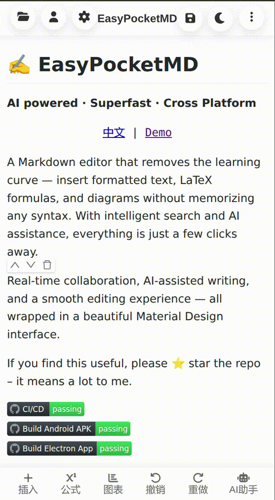
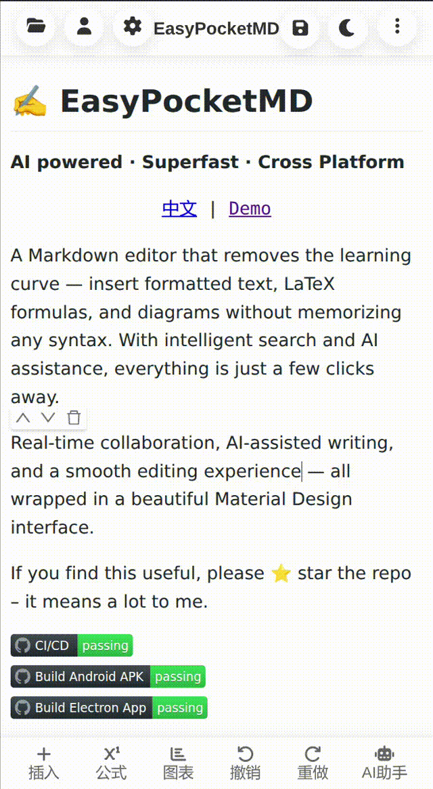
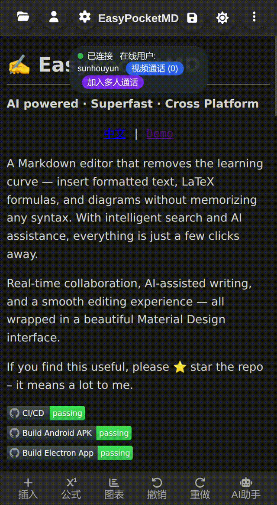
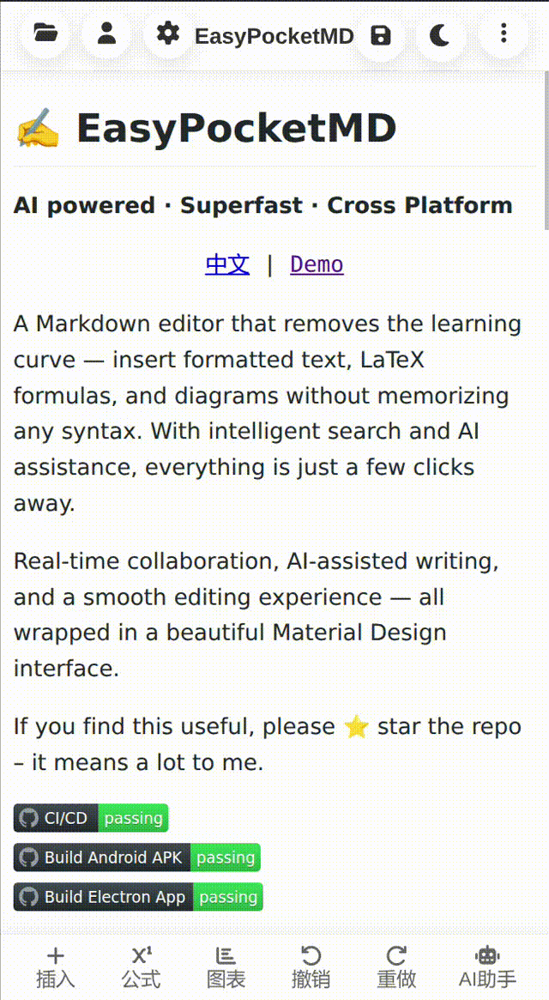
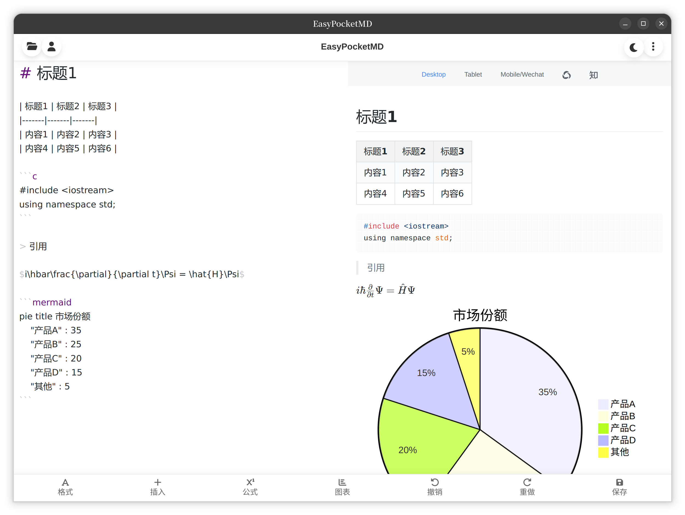
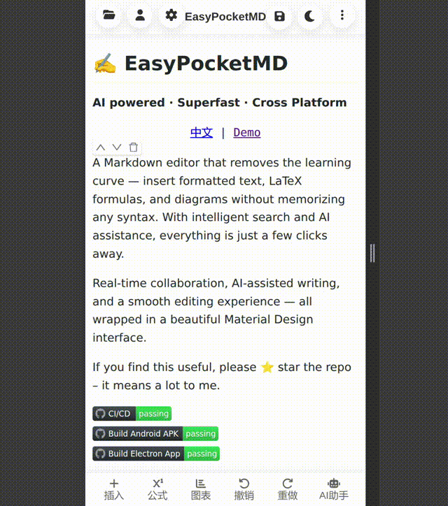

# EasyPocketMD


**AI powered · Superfast · Cross Platform**

<p align="center"><a href="README_zh_CN.md">中文</a> &nbsp;|&nbsp; <a href="https://md.yhsun.cn/">Demo</a></p>

A Markdown editor that removes the learning curve — insert formatted text, LaTeX formulas, and diagrams without memorizing any syntax. With intelligent search and AI assistance, everything is just a few clicks away.

Real-time collaboration, AI-assisted writing, and a smooth editing experience — all wrapped in a beautiful Material Design interface.

If you find this useful, please ⭐ star the repo – it means a lot to me.

[](https://github.com/sunhouy/EasyPocketMD/actions/workflows/deploy.yml)
[](https://github.com/sunhouy/EasyPocketMD/actions/workflows/build-android.yml)
[](https://github.com/sunhouy/EasyPocketMD/actions/workflows/build-electron.yml)

[](https://www.python.org/downloads/)
[](https://nodejs.org/)

## 📖 Table of Contents
- [Features](#-features)
- [Quick Start](#-quick-start)
- [Comparison](#-how-we-compare)
- [Architecture](#-project-architecture)
- [Deployment](#-deployment)
- [Demo](#-demo)
- [License](#-license)

## ✨ Features

### 🤖 AI Integration

- AI Writing Assistant – Help write, rewrite, auto-format, and even generate PPT slides from your document.

- Smart Charts & Formulas – Generate LaTeX formulas and diagrams with AI prompts — no manual coding required.


### 👥 Collaboration & Communication

- Real-time Collaboration – Share documents and work together seamlessly.

- Encrypted Video Call – Built-in two-person encrypted video call with dual-stack IPv6 support.


### ✍️ Editing Experience
- Three Preview Modes – WYSIWYG, live rendering, and split-screen preview.
- Efficient Editing – Quick insertion of Markdown, LaTeX formulas, and charts. Full-text search and file diff support.

- Version Control – Browse history and compare differences between versions.



### 🔗 Compatibility & Design
- Cross Platform – Works seamlessly across devices.

- File Import / Export – Import local documents; export to TXT, DOC, PDF, and more.
- Cloud Print – Print remotely via the cloud print client.

- Available on Windows, Linux, Android and the web — with consistent behavior across all platforms.
- Modern UI – Clean Material Design with day/night mode support.

## 🚀 Quick Start
### Prerequisites
- Node.js ≥ 18.0
- Python ≥ 3.6
- MySQL ≥ 5.7
- Redis ≥ 6.0
- npm ≥ 9.0

### Installation

1. Clone the repository
```bash
git clone https://github.com/sunhouy/EasyPocketMD.git
cd md
```

2. Install Node.js dependencies
```bash
npm install
```

3. Copy the example configuration file and edit it with your own values:
```
cp .env.example .env
```

4. Set up databases
Create the MySQL database and tables. You can find the schema in db.sql. Ensure Redis is running.

5. Build the frontend
```bash
npm run build
```

6. Start the application
```bash
npm start
```
For production (using PM2):
```bash
npm install -g pm2
pm2 start api/server.js --name "easypocketmd"
```


## 📊 How We Compare

| Feature                     | **Ours** | Typora | Obsidian | Notion | VS Code | Joplin                 |
|-----------------------------|---------|--------|----------|--------|---------|------------------------|
| **Data Privacy**            | 🔒 Local + Cloud | Local | Local | Cloud-only | Local | Local + Cloud optional |
| **AI Writing Assistant**    | ✅ Native | ❌ | ❌ (via plugin) | ❌ | ❌ (via plugin) | ❌                      |
| **AI Charts & Formulas**    | ✅ Native | ❌ | ❌ | ❌ | ❌ | ❌                      |
| **AI PPT Generation**       | ✅ Native | ❌ | ❌ | ❌ | ❌ | ❌                      |
| **Mobile Experience**       | 📱 First-class | Basic | Basic | Good | None | Basic                  |
| **Real-time Collaboration** | ✅ E2EE encrypted | ❌ | ❌ | ✅ | ✅ (Live Share) | ❌                      |
| **Encrypted Video Call**    | ✅ Built-in | ❌ | ❌ | ❌ | ❌ | ❌                      |
| **Cloud Print**             | ✅ Native | ❌ | ❌ | ❌ | ❌ | ❌                      |
| **Price**                   | Free / Open Source | $15 one-time | Free / $50/yr sync | Free tier | Free | Free                   |


## 🏗️ Project Architecture

The project uses a JavaScript + Python architecture. The backend is implemented with Node.js, while the cloud printing server and client are implemented with Python. The frontend is developed with native JavaScript, ensuring excellent performance.
```
api/     Backend API interfaces
assets/  Capacitor application resources
css/     Frontend CSS styles
js/      Frontend JavaScript scripts
print/   Cloud printing server and client code
scripts/ Deployment scripts
tests/   Test scripts
```

## 🎬 Demo

<https://md.yhsun.cn/>

## 📧 Contact
`18763177732@139.com`

## 📄 License
This project is licensed under the MIT License.

## 🙌 Acknowledgements
Built with ❤️ using modern web technologies and open source tools.

I'm deeply grateful to all the open‑source projects and their contributors that made EasyPocketMD possible.  

See [DEPENDENCIES.md](./DEPENDENCIES.md) for the complete list of dependencies and licenses.